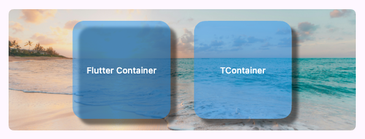

# TWidgets <!-- omit in toc -->

A Flutter UI toolkit featuring a custom shadow painter that prevents shadows from
bleeding through semi-transparent widget surfaces.

My initial goal in creating this library was to address a standard Flutter rendering behavior
where box shadows are drawn directly behind translucent widgets.

Using a custom painter, TWidgets renders shadows similar to HTML/CSS box-shadow specifications,
preventing shadows from bleeding through semi-transparent widget bodies.



## Platform support

| Android |  iOS  | macOS |  Web  | Linux | Windows |
| :-----: | :---: | :---: | :---: | :---: | :-----: |
|    ✅    |   ✅   |   ✅   |   ❌   |   ✅   |    ✅    |

## Index <!-- omit in toc -->

- [Widgets](#widgets)
  - [TContainer](#tcontainer)
- [Utils](#utils)
  - [TAdaptiveShapes](#tadaptiveshapes)
  - [TPlatform](#tplatform)
- [License](#license)

<div style="height: 24px"></div>

# Widgets

## TContainer

`TContainer` provides an adaptive rounded shape, a clipped translucent background,
and shadows that do not appear through the widget body.

```dart
TContainer(
  width: 200,
  height: 200,
  color: Colors.blue.withAlpha(128),
  borderRadius: 16,
  shadows: [
    BoxShadow(
      color: Color(0x80000000),
      offset: Offset(10, 10),
      blurRadius: 3,
    ),
  ],
  child: Text('TContainer'),
);

```
| Property        | Type                 | Defaults to             |
| --------------- | -------------------- | ----------------------- |
| width           | `double?`            | `null`                  |
| height          | `double?`            | `null`                  |
| minWidth        | `double`             | `0.0`                   |
| maxWidth        | `double`             | `double.infinity`       |
| minHeight       | `double`             | `0.0`                   |
| maxHeight       | `double`             | `double.infinity`       |
| clipBehavior    | `Clip`               | `Clip.hardEdge`         |
| borderShape     | `TBorderShape`       | `TBorderShape.adaptive` |
| borderRadius    | `double`             | `0.0`                   |
| borderSide      | `BorderSide`         | `BorderSide.none`       |
| margin          | `EdgeInsetsGeometry` | `EdgeInsets.zero`       |
| padding         | `EdgeInsetsGeometry` | `EdgeInsets.zero`       |
| alignment       | `AlignmentGeometry`  | `Alignment.center`      |
| color           | `Color?`             | `null`                  |
| gradient        | `Gradient?`          | `null`                  |
| decorationImage | `DecorationImage?`   | `null`                  |
| backgroundBlur  | `double`             | `0.0`                   |
| blendMode       | `BlendMode?`         | `null`                  |
| shadows         | `List<BoxShadow>`    | `[]`                    |
| child           | `Widget?`            | `null`                  |

# Utils

## TAdaptiveShapes

A collection of methods that provides common Flutter shapes adapted to the target platform, using superellipse shapes
on Apple platforms and rounded rectangles elsewhere.

### `shapeBorder` <!-- omit in toc -->

Returns `RoundedSuperellipseBorder` on Apple platforms and `RoundedRectangleBorder` otherwise.

```dart
TAdaptiveShapes.shapeBorder(radius = 0.0, side = BorderSide.none, shape = TBorderShape.adaptive);
```

### `outlinedBorder` <!-- omit in toc -->

Returns `TAdaptiveShapes.shapeBorder()` as `OutlinedBorder`.

```dart
TAdaptiveShapes.outlinedBorder(radius = 0.0, side = BorderSide.none, shape = TBorderShape.adaptive);
```

### `clipShape` <!-- omit in toc -->

Returns `ClipRSuperellipse` on Apple platforms and `ClipRRect` otherwise.

```dart
TAdaptiveShapes.clipShape(radius = 0.0, side = BorderSide.none, shape = TBorderShape.adaptive);
```

## TPlatform

***Web-Safe*** operating system checking, and device type from the screen/view size.

> [!NOTE]
> If you want more detailed information about the current device, I recommend the
> [device_info_plus](https://pub.dev/packages/device_info_plus) package.

| Boolean     | Description                                 |
| ----------- | ------------------------------------------- |
| `isWeb`     | Current platform is a web browser.          |
| `isAndroid` | Current operating system is Android.        |
| `isIOS`     | Current operating system is iOS.            |
| `isMacOS`   | Current operating system is macOS.          |
| `isLinux`   | Current operating system is a Linux distro. |
| `isWindows` | Current operating system is Windows.        |
| `isFuchsia` | Current operating system is Fuchsia OS.     |
| `isApple`   | Current platform is an Apple one.           |
| `isGoogle`  | Current platform is a Google one.           |
| `isMobile`  | Current device is a Mobile Phone.           |
| `isDesktop` | Current device is a Desktop.                |
| `isTablet`  | Current device is a Tablet.                 |

# License

Licensed under the MIT License.  
See LICENSE file in the project root for full license information.
